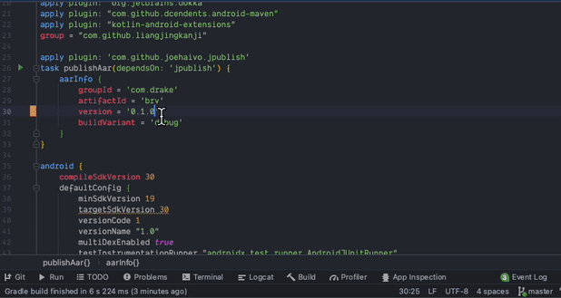

> 在安卓组件化开发中，一般都有将自己写好的组件(aar)发布到公司私有Maven仓库的需求，一般采用`maven-publish`插件发布，这里我介绍一个插件帮助大家快速发布组件

### 效果预览



### 使用

- 1. 在工程根目录`build.gradle`文件中添加jitpack仓库源及依赖

```groovy
buildscript {
		repositories {
				...
				maven { url 'https://jitpack.io' }
		}
  
  	dependencies {
      	...
     		classpath "com.github.Joehaivo:JPublish:1.0.0" 
    }
}
```

- 2. 在模块级别的`build.gradle`文件中添加以下代码，并根据当前模块填写`aarInfo`信息

```groovy
apply plugin: "com.android.library"
...
apply plugin: 'com.github.joehaivo.jpublish'
task YourTaskName(dependsOn: 'jpublish') {
    aarInfo {
        groupId = 'com.xxx.xxx'
        artifactId = 'xxx'
        version = '0.1.1-SNAPSHOT'
        buildVariant = 'debug'
    }
}
```

- 3. 在工程根目录`gradle.properties`文件中添加：

```properties
MAVEN_SNAPSHOT_URL=http://Your-Private-Maven-Repository-Snapshot-Url
MAVEN_RELEASE_URL=http://Your-Private-Maven-Repository-Release-Url
```

- 4. 在工程根目录`local.properties`文件中添加账号信息(推荐)，也可以填写在`gradle.properties`中(不推荐)

```properties
MAVEN_USERNAME=Your-Private-Maven-Repository-Username
MAVEN_PASSWORD=Your-Private-Maven-Repository-Password
```

- 5. 点击 `task YourTaskName(dependsOn: 'jpublish') {` 左侧的绿色三角`▶️`运行即可，发布成功会在`Build Output`窗口打印发布地址


### 字段及解释

| 字段             | 必选 | 类型   | 解释                                                         |
| ---------------- | ---- | ------ | ------------------------------------------------------------ |
| YourTaskName     | Yes  | String | 打包时的任务名，同一工程不可重名，可采取publish + ModuleName |
| groupId          | Yes  | String | maven坐标的groupId                                           |
| artifactId       | Yes  | String | maven坐标的artifactId                                        |
| version          | Yes  | String | 正式发布时请去掉'-SNAPSHOT', 尽量遵循Gradle的版本号规则：x.y.z |
| buildVariant     | Yes  | String | 打包类型, 可打开Android Studio中`Build Variants`窗口参考选择 |
| mavenReleaseUrl  | No   | String | 私有maven仓库(私服)release包的地址                           |
| mavenSnapshotUrl | No   | String | 私有maven仓库snapshot包的地址                                |
| mavenUsername    | No   | String | 私有maven仓库的账号                                          |
| mavenPassword    | No   | String | 私有maven仓库的密码                                          |

### 项目地址

[Github地址](https://github.com/Joehaivo/JPublish)

[JitPack发布地址](https://jitpack.io/#Joehaivo/JPublish)
